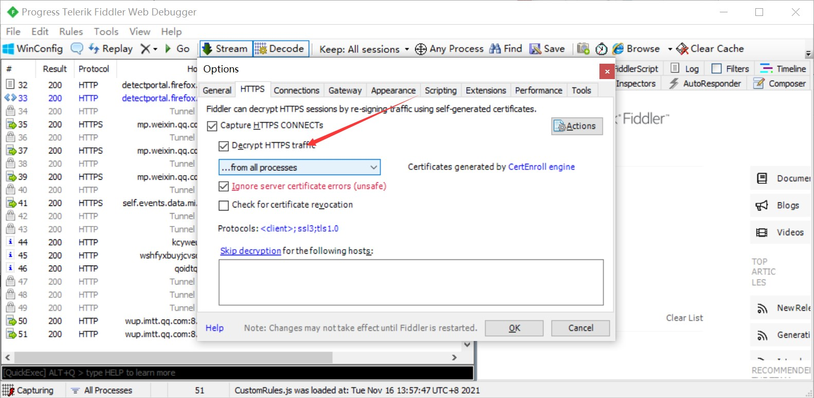
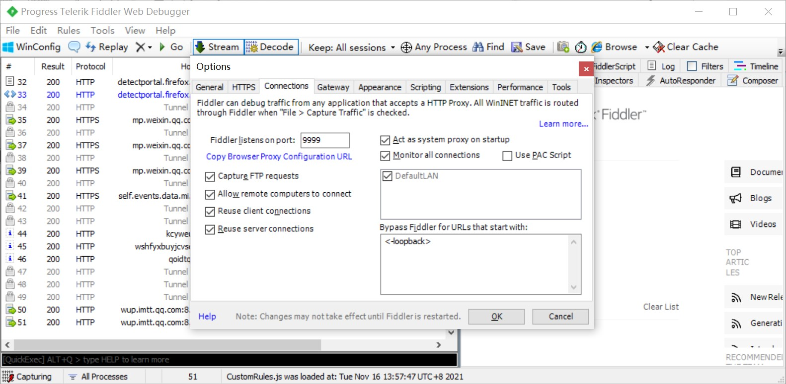

# Get_Xcc_Sub_Domain

一款快速爬取小程序域名的爬虫工具,精准匹配爬取目标,查询方便,能生成利用列表。


# 快速开始


1.在cmd命令窗口下使用该命令

```shell
 python3 get_xcc_sub_domain.py
```

2.输入爬取目标名字,数量(这里可以直接填写1000直接爬完所有目标),cookie。


# cookie获取步骤说明


1.首先我们得抓取微信上搜索小程序使用的cookie,熟悉小程序抓包的师傅们就不用看了,这里我讲一个简单的方法,当然网上也有很多啦,我们登录电脑的微信,设置一个代理127.0.0.1:8080,bp也是这个代理,然后使用fildder4转发流量,设置步骤如下图就行了







2.然后就可以登录微信搜索小程序,抓包获取到cookie值,如下图所示:


